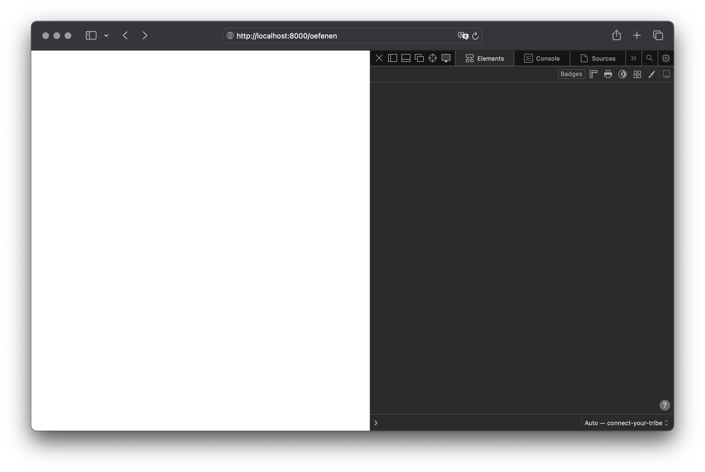
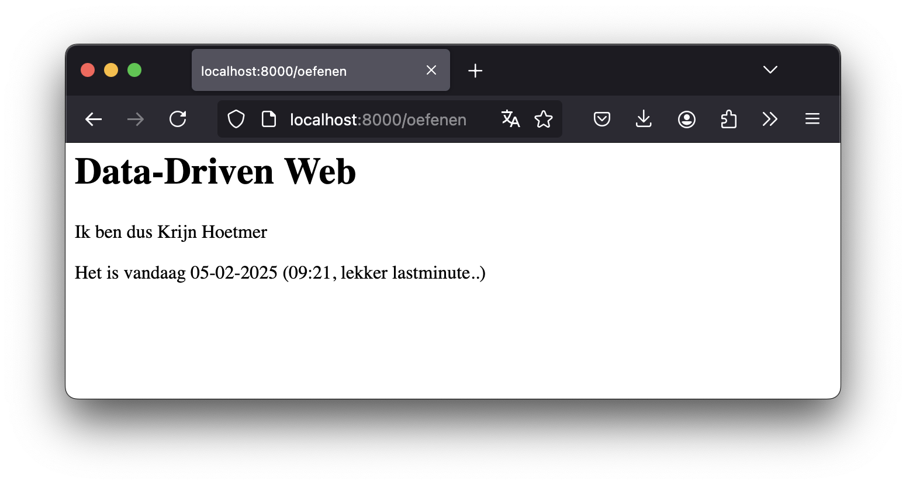

# Connect Your Tribe - Visitekaartje

## REST API en JSON

Over het maken van je visitekaart met JSON, NodeJS, Express en Liquid.


### Aanpak

Vanochtend gaan we oefenen met het nieuwe gereedschap dat we tot onze beschikking hebben. We gaan samen een nieuwe pagina bouwen, waarop we als herhaling onze eigen naam gaan tonen. En we gaan de datum van vandaag erbij zetten, omdat het kan. Vervolgens maken we een overzicht van wie er op dit moment bij je aan tafel zit. Niet met statische HTML, zoals in Semester 1, maar met dynamische data.

Hiermee leren we wat meer over _Routing_, _Views_, _Express_, _Liquid_, _JSON_ en onze _API_ (Directus).


## Oefenen met Routes en Views

In Semester 1 kon je een nieuwe pagina toevoegen door een nieuw HTML bestand aan te maken. In Express werkt dit net even anders. We moeten hiervoor een nieuwe _Route_ aanmaken in onze Express server.

Je gaat eerst een nieuwe pagina maken in jouw nodeJS project:


Routes zijn de stukjes achter de URL waar je site op draait. Een nieuwe route toevoegen, doe je in `server.js`.

Zoek in dat bestand op waar de route naar je visitekaartje staat (waarschijnlijk is dat nog `/`, op regel 41, als je alleen je `personID` aangepast hebt tot nu toe).

Routes kun je koppelen aan _Views_, door een _callback function_. Elke keer dat een bezoeker een bepaalde route bezoekt, wordt de callback function uitgevoerd. In die functie wordt een view _gerenderd_ (niet te verwarren met Render, waar we de site hosten). In dit geval wordt op de root URL `/` de view `index.liquid` gerenderd. Aan die view wordt een object meegegeven. Met de data uit de API, zodat die gegevens ook in die view gebruikt kunnen worden. Als je geen data meegeeft aan de view, kan deze die data ook niet tonen.

Maak eerst een nieuw leeg bestand aan in de map `views`, genaamd `oefenen.liquid`.

Maak daarna in `server.js` een extra route aan voor de URL `/oefenen`, en zorg dat `oefenen.liquid` gerenderd wordt als die URL bezocht wordt. Kopieer hiervoor de paar regels van de `/` route, en pas deze aan. Meestal zet je routes bij elkaar in de buurt, zodat je snel terug kunt vinden welke routes er allemaal voor je website aangemaakt zijn.

(Her)start je lokale server door `npm start` uit te voeren; voor elke wijziging in `server.js` moet je dit doen. Open http://localhost:8000/oefenen in je browser, en controleer of je een lege pagina krijgt. Als je een foutmelding krijgt, laat het dan even weten :)

### Bronnen

- [Routes in Express, met `app.get(..., ...)`](https://expressjs.com/en/5x/api.html#app.get.method)


## Spelen met Liquid filters

Voor deze opdracht ga je je naam toevoegen aan de nieuwe view en de datum van vandaag tonen:


Voeg aan `oefenen.liquid` de volgende code toe:

```liquid
<h1>Data-Driven Web</h1>
<p>Ik ben dus {{ person.name }}</p>
```

Controleer of je ook op deze pagina je eigen naam te zien krijgt, door de pagina te verversen (bij een wijziging in de `views` of `public` map hoef je de server niet opnieuw op te starten).

Krijg je niet je naam te zien, dan heb je waarschijnlijk wat van de stappen van [maandag](visitekaartje-met-nodejs.md) gemist. Laat het even weten als dit je nog niet gelukt is. We zijn er om je te helpen een goede frontender te worden.

Voeg vervolgens deze code toe aan je pagina:

```liquid
<p>Het is vandaag {{ 'now' | date }}</p>
```

En ververs de pagina. Waarschijnlijk niet helemaal wat je gehoopt had, en waarschijnlijk ook niet wat je bezoekers willen lezen.

Zorg er met de documentatie van het Liquid `date` _filter_ voor dat de datum in een iets vriendelijke formaat getoond wordt. Niet door de datum keihard in je HTML neer te zetten, maar door de dynamische datum om te zetten naar wat anders.

Als dat gelukt is, en je hebt in de whois database je eigen geboortedatum ingevuld, laat die dan ook zien op deze pagina. (Heb je geen idee waar die whois database over gaat, volg dan nog even de [Sprint planning van maandag](sprint-planning.md).) Kun je die datum ook beter leesbaar tonen?

🐛 Tip: Als je niet meer weet hoe die _property_ van het `person` object heet (was het nou `birthdate` of `birth_date`?), zet `{{ person | json }}` in je code, en bekijk het antwoord in je pagina.

💡 Pro-tip: zorg dat je tijdens het bouwen en debuggen standaard ergens op je pagina een fixed positioned `<details>` element hebt, met daarin een `<pre>` element en `{{ person | json:4 }}` — dan kun je altijd even spieken in je data.

💪 Had je je `custom` property (niet te verwarren met CSS Custom Properties) nog niet gebruikt, maar wil je dat wel graag? Dan zul je met `JSON.parse()` aan de slag moeten. Een aantal medestudenten is dit inmiddels al gelukt, dus de kennis is aanwezig binnen je squad! Schrijf op het whiteboard in groen je naam als je dit al in je code hebt. En teken er een bosje peterselie bij, zodat anderen je weten te vinden. (Parsley? Nee? Niemand into woordgrappen op dit tijdstip? I'll get my coat..)

### Bronnen

- [Liquid date filter](https://liquidjs.com/filters/date.html)
- [Liquid json filter](https://liquidjs.com/filters/json.html)
- [JSON.parse() @ MDN](https://developer.mozilla.org/en-US/docs/Web/JavaScript/Reference/Global_Objects/JSON/parse)


## 💪 Extra data van anderen uit de API halen

Als je hoofd nu duizelt, en je vooral weer met de HTML en CSS van je visitekaartje aan de gang wilt gaan, helemaal prima. Wil je wel nog een uitdaging, en alvast een voorbereiding op wat we komende week gaan doen, lees dan rustig verder.

In de nieuwe view ga je ook de namen van je tafelgenoten tonen:


Voeg in je view de volgende code toe:

```liquid
<h2>Bij mij aan tafel zitten nu:</h2>
```

Vraag aan de mensen die nu bij je aan tafel zitten even hun whois ID's, en schrijf die ergens op. We reduceren je tafelgenoten even tot een nummer. Tijdelijk.

Je hebt bij het ophalen van je eigen gegevens gezien dat dat via deze URLs kan (als je je eigen ID erin zet):

```
https://fdnd.directus.app/items/person/234
https://fdnd.directus.app/items/person/?filter={"id":234}
```

Stel dat je drie andere studenten aan je tafel hebt zitten, dan zou je drie keer een andere URL met JSON kunnen binnenhalen, drie extra variabelen aan kunnen maken (`person1`, `person2` en `person3`), drie extra objecten mee kunnen geven aan de view, en drie `<article>` tags met elk een eigen `{{ person1.name }}`, `{{ person2.name }}` en `{{ person3.name }}` kunnen schrijven. Maar als er dan iemand even lunch gaat halen, of bij je komt zitten voor een code review, moet je behoorlijk wat code aanpassen. Niet DRY, niet onderhoudbaar, niet dynamisch. Dan hadden we dit semester net zo goed niet Data-Driven kunnen noemen.

Dat kan gelukkig slimmer. In onze Directus API kun je ook op deze manier data filteren:

```
https://fdnd.directus.app/items/person?filter={"_or":[{"id":65},{"id":67}]}
```

Deze URL geeft personen terug, die het ID `65` _of_ `67` hebben. Dat zijn er twee in dit geval. Hm, interessant. Heb je al door wat hier gebeurt? `filter` in deze URL is een _query parameter_, en je kunt hierin JSON meegeven, waarmee je specifiekere filters op de data kunt maken.

Pas met je kennis van JSON de URL in je adresbalk zo aan, dat je de JSON data van de mensen om je heen krijgt te zien. Als dat er drie zijn, voeg dan drie ID's toe in de _array_. Niet schrikken als je wat foutmeldingen van Directus krijgt; waarschijnlijk heb je dan net een komma, quote, bracket of curly verkeerd staan. Of iets anders. Gewoon doorgaan met klooien en pielen. En hulp vragen als het niet lukt.

Als je de werkende URL hebt, hoeven we die alleen nog in onze code te verwerken.

Naast dat je eigen data wordt opgehaald en mee wordt gestuurd naar de view, willen we nu dus wat meer data ophalen uit onze API, met een extra `fetch`. Dit ophalen van data kan op meerdere plekken: zoals nu, tijdens het starten van de server, maar het kan ook op het moment _net voordat_ de view wordt gerenderd. Dus op het moment dat iemand de pagina bezoekt. Hoe en waar je dat doet, mag je zelf weten. Er zitten voor- en nadelen aan beide plekken. Zoals met wel meer: _It Depends_. In dit geval hebben we deze gegevens alleen nodig op `/oefenen`, niet op de homepage.

...

<!--
Uittypen als je helder bent morgenochtend :)

Voer in de callback function van de `/oefenen` route, _voor_ de `response.render(...)` een extra `fetch` en 

Geef die nieuwe data als extra object mee aan de view.

Voeg in..


in de view een loop maken van iedereen die aan je tafel zit, inclusief hun naam => al iets meer advanced, maar dan zien ze pas de kracht van dynamische data
daarna voor die personen geboortedatum ook toevoegen, en dan zien ze hopelijk het nut van templates in (1 aanpassing -> 3 extra <p>'tjes)

-->

### Bronnen

- [Directus Query Parameters: filter](https://directus.io/docs/guides/connect/query-parameters#filter)
- [Directus Filter Rules](https://directus.io/docs/guides/connect/filter-rules)
- [Liquid For loop](https://liquidjs.com/tags/for.html)


